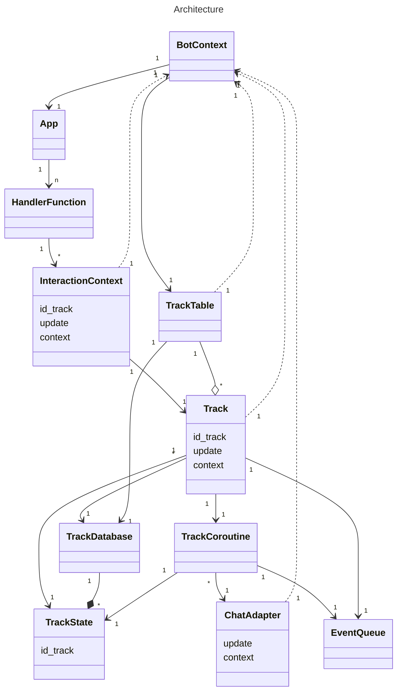

# My Project

This is a description of my project.

## Installation

To install the project, follow these steps:

1. Clone the repository: `git clone https://github.com/yourusername/yourproject.git`
2. Install dependencies: `npm install`

## Usage

To use the project, follow these steps:

1. Run the application: `npm start`
2. Open your web browser and navigate to `http://localhost:3000`

## Diagram

Below is a visualization of the project architecture:

